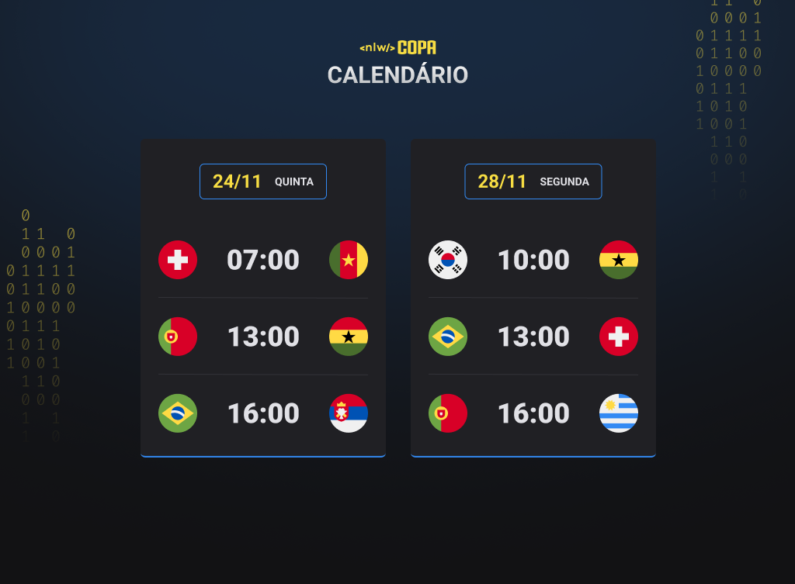

<h1 align="center"> Next Level Week - Copa </h1>

Evento exclusivo e gratuito, promovido pela Rocketseat para ensino de tecnologias WEB.

  <a href="#-tecnologias">Tecnologias</a>&nbsp;&nbsp;&nbsp;|&nbsp;&nbsp;&nbsp;
  <a href="#-projeto">Projeto</a>&nbsp;&nbsp;&nbsp;|&nbsp;&nbsp;&nbsp;
  <a href="#-layout">Layout</a>&nbsp;&nbsp;&nbsp;|&nbsp;&nbsp;&nbsp;
  <a href="#memo-licença">Licença</a>

  

  

 

---

 

## 💻 Tecnologias

Esse projeto foi desenvolvido com as seguintes tecnologias:

- HTML e CSS
- JavaScript

 

## 📚 Projeto

O **Calendário de Jogos** é uma aplicação web que permite exibir jogos da Copa do Mundo de 2022.

 

## 🔖 Layout

Você pode visualizar o layout do projeto através [desse link]().

 

## 📄 Licença

Esse projeto está sob a licença MIT.
